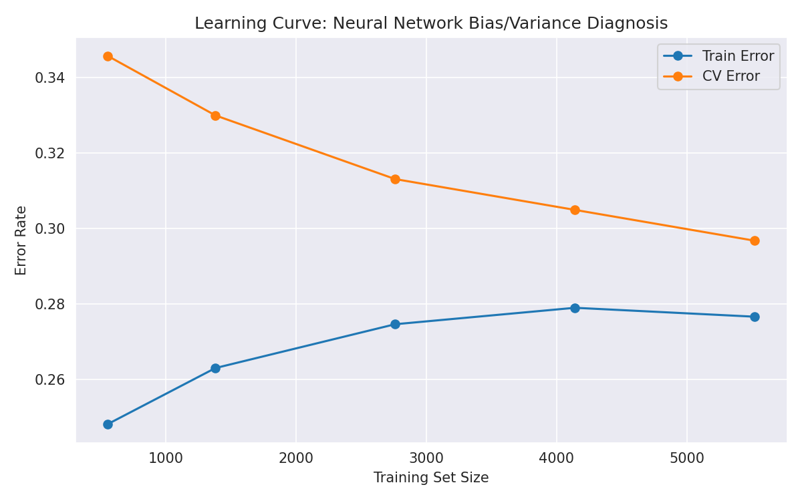
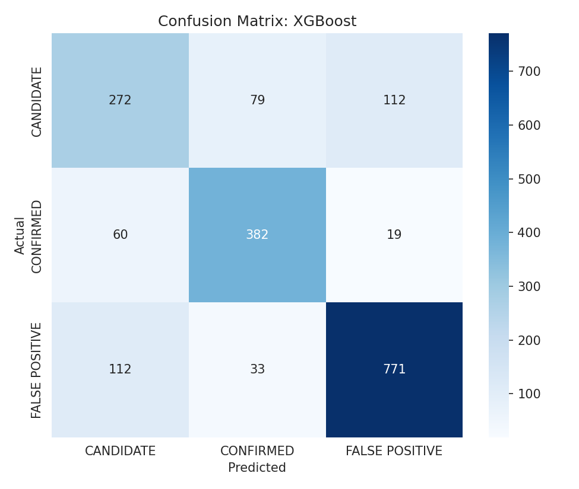
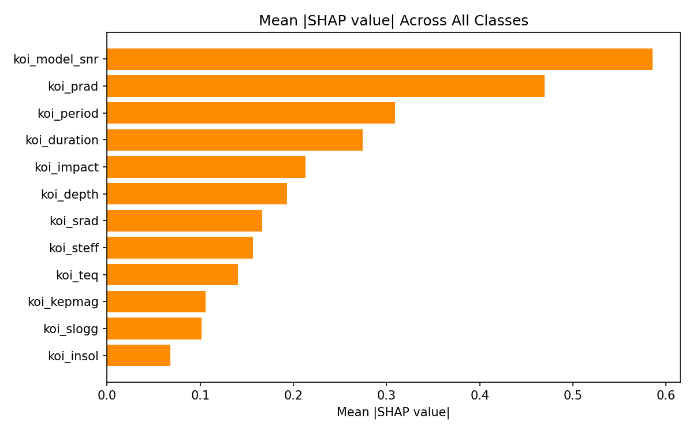
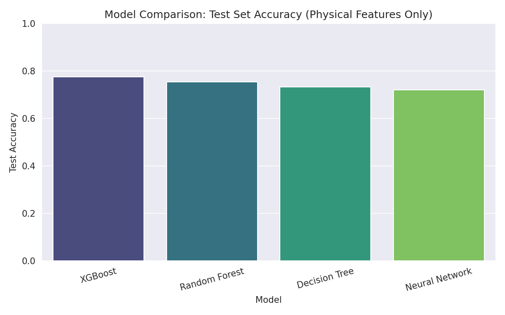

# 🪐 Exoplanet Disposition Classifier

An end-to-end machine learning project that classifies **real NASA Kepler mission data** — determining whether an observed transit signal is a `CANDIDATE`, a `CONFIRMED` exoplanet, or a `FALSE POSITIVE`. Built after completing **Advanced Learning Algorithms** (DeepLearning.AI / Stanford Online, via Coursera), applying neural networks, bias/variance diagnosis, and tree-based ensembles to a genuine astrophysics dataset — and includes an interactive Streamlit app for exploring predictions live.

> This is an educational project, not an official NASA classification tool.

---

## 📸 Sample Results

**Bias/variance learning curve** — train and cross-validation error converging and plateauing, the evidence behind this project's model-selection decisions:



**Confusion matrix** — the best model's errors concentrate exactly where real Kepler vetting is hardest (Candidate ↔ False Positive):



**SHAP feature importance** — which physical parameters actually drive each prediction:



**Model comparison** — Neural Network vs. Decision Tree vs. Random Forest vs. XGBoost, same train/test split:



## 🖼️ App Screenshots

*Add your own screenshots here after running the app locally (`streamlit run app.py`):*

1. Take a screenshot of the app (prediction panel + SHAP explanation)
2. Save it into a `screenshots/` folder in the repo root, e.g. `screenshots/app_overview.png`
3. Replace this section with:
   ```markdown
   
   ```

---

## 🎯 What this project demonstrates

| Concept from the course | Where it's used |
|---|---|
| Multiclass neural networks (softmax) | `train_model.py` — TensorFlow/Keras classifier |
| Bias/variance diagnosis | Learning curve across training-set size (`plots/learning_curve.png`) |
| Decision Trees, Random Forests, Boosted Trees | Three tree-based classifiers trained and compared directly |
| Model evaluation | Accuracy, precision/recall/F1, ROC-AUC, confusion matrix |
| Data integrity / leakage awareness | Explicit test showing automated vetting flags would inflate accuracy — and why they're excluded |
| Hyperparameter tuning | `tune_hyperparameters.py` — RandomizedSearchCV, honestly reported even when the gain is small |
| Feature engineering | `feature_engineering.py` — domain-motivated derived features, tested rather than assumed to help |
| Model explainability | `explain_model.py` — SHAP values, also surfaced live in the app per-prediction |
| Real-world deployment | Interactive Streamlit app (`app.py`) |

## 📊 Dataset

**[NASA Exoplanet Archive — Kepler Cumulative KOI Table](https://exoplanetarchive.ipac.caltech.edu/cgi-bin/TblView/nph-tblView?app=ExoTbls&config=cumulative)**

9,564 Kepler Objects of Interest, each with real measured and derived parameters from the mission's transit-detection pipeline (orbital period, transit depth and duration, planetary radius, stellar temperature, signal-to-noise, and more). This is the same underlying table behind the well-known "Kepler Exoplanet Search Results" dataset on Kaggle. A cleaned copy is included at `data/kepler_koi.csv`.

## ⚠️ An honest data leakage check

The raw table includes four automated vetting flags (`koi_fpflag_nt/ss/co/ec`) computed by Kepler's own pipeline — essentially the pipeline's own preliminary verdict on each signal. Training a model **with** these flags reaches **91.0% test accuracy**. But since those flags are themselves near-automated determinations of disposition rather than independent physical measurements, that number overstates what can genuinely be learned from physical parameters alone.

This project checks that explicitly, reports it, and then **excludes those flags from the primary model** — a more honest (and harder) task: classify disposition from physical/observational parameters only.

## 📈 Results (physical features only, no vetting flags)

| Model | Test Accuracy |
|---|---|
| **XGBoost** | **0.774** |
| Random Forest | 0.755 |
| Decision Tree | 0.733 |
| Neural Network | 0.721 |

**Best model: XGBoost** — macro ROC-AUC (OvR): **0.911**

```
                precision    recall  f1-score   support

     CANDIDATE       0.61      0.59      0.60       463
     CONFIRMED       0.77      0.83      0.80       461
FALSE POSITIVE       0.85      0.84      0.85       916
```

**What the confusion matrix shows:** almost all misclassification happens between `CANDIDATE` and `FALSE POSITIVE` — the two hardest categories to tell apart even for the Kepler pipeline itself, since a "candidate" is by definition a signal that hasn't been fully vetted yet. `CONFIRMED` is separated cleanly from both. This pattern is physically sensible, not a modeling artifact.

**What the learning curve shows:** train and cross-validation error converge and plateau around 0.28–0.30 as training data grows (`plots/learning_curve.png`) — a bias-dominated regime. This indicates the model has largely saturated what these 12 features can offer; more rows of data would not meaningfully improve it further. Better performance would require richer features (e.g. transit shape statistics), not more data.

## 🔬 Testing the bias-plateau hypothesis: tuning and feature engineering

The learning curve suggested this model is *bias-limited*, not *data-limited*. Two follow-up experiments tested that claim directly, rather than leaving it as a guess:

**1. Hyperparameter tuning** (`tune_hyperparameters.py`) — RandomizedSearchCV over 40 candidate configurations × 5-fold cross-validation (200 fits) for XGBoost:

| | Test Accuracy |
|---|---|
| Baseline (default hyperparameters) | 0.7745 |
| Tuned (RandomizedSearchCV) | 0.7750 |
| **Improvement** | **+0.05 pp** |

**2. Feature engineering** (`feature_engineering.py`) — added 6 domain-motivated derived features (transit-duration-to-period ratio, log-transforms of skewed variables, planet-to-star radius ratio, an SNR × impact-parameter interaction):

| | Test Accuracy | ROC-AUC |
|---|---|---|
| Baseline (12 raw features) | 0.7745 | 0.9113 |
| Engineered (18 features) | 0.7755 | 0.9143 |
| **Improvement** | **+0.11 pp** | +0.0030 |

**Conclusion:** both interventions moved accuracy by a fraction of a percentage point — confirming the learning curve's diagnosis. The ~77% ceiling on physical parameters appears to be close to the genuine information limit of this feature set for this task, not a symptom of under-tuning or naive feature representation. Meaningfully surpassing it would likely require a different data modality entirely — e.g. the full transit light curve shape, rather than its summary statistics.

## 🔍 Model Explainability (SHAP)

`explain_model.py` computes SHAP (SHapley Additive exPlanations) values for the trained model, both globally and per-class:

- `plots/shap_overall_importance.png` — mean absolute SHAP value per feature across all classes
- `plots/shap_summary_confirmed.png`, `_candidate.png`, `_false_positive.png` — per-class summary plots showing each feature's direction of effect

The top global drivers — transit signal-to-noise (`koi_model_snr`) and planetary radius (`koi_prad`) — line up with what an astronomer would expect: a low-SNR or implausibly large "planet" is exactly the profile of a false positive.

The Streamlit app also surfaces a **live, per-prediction SHAP breakdown** — for any slider configuration you try, it shows which specific inputs pushed the prediction toward or away from the predicted class.

## 🖥️ Interactive Web App

Run the live demo locally:

```bash
pip install -r requirements.txt
python train_model.py     # trains models and saves artifacts (see below)
streamlit run app.py
```

**Features:**
- 🎚️ Adjust all 12 physical parameters with sliders (ranges drawn from the real dataset's 1st–99th percentiles)
- 🎯 Live disposition prediction with class-probability bar chart
- 🔍 Live SHAP explanation of each individual prediction
- ⚡ Quick presets: dataset median, typical confirmed exoplanet, typical false positive
- Transparent model-limitation notice about the excluded vetting flags

## 📓 Training Script

```bash
python train_model.py
```

This single script:
1. Loads and cleans the real Kepler KOI table
2. Runs the leakage check described above
3. Splits data into train / cross-validation / test sets
4. Trains a neural network and generates a bias/variance learning curve
5. Trains Decision Tree, Random Forest, and XGBoost classifiers
6. Evaluates all models and saves comparison plots
7. Saves the best model, scaler, and label encoder for use by `app.py`

Outputs land in `plots/` and as `.joblib`/`.keras` model artifacts in the repo root, plus a `results_summary.txt`.

## Project Structure

```
exoplanet-classifier/
├── data/
│   └── kepler_koi.csv                  # Real NASA Kepler Cumulative KOI Table
├── notebook/
│   └── exoplanet_classification.ipynb  # Full interactive analysis
├── plots/
│   ├── class_distribution.png
│   ├── correlation_matrix.png
│   ├── learning_curve.png
│   ├── model_comparison.png
│   ├── confusion_matrix.png
│   ├── feature_importance.png
│   ├── shap_overall_importance.png
│   ├── shap_summary_confirmed.png
│   ├── shap_summary_candidate.png
│   └── shap_summary_false_positive.png
├── train_model.py                      # Trains all models, saves artifacts + plots
├── tune_hyperparameters.py             # RandomizedSearchCV tuning for XGBoost
├── feature_engineering.py              # Tests domain-motivated derived features
├── explain_model.py                    # Generates SHAP explainability plots
├── app.py                              # Interactive Streamlit prediction app
├── results_summary.txt                 # Output of train_model.py
├── tuning_results.txt                  # Output of tune_hyperparameters.py
├── feature_engineering_results.txt     # Output of feature_engineering.py
├── requirements.txt
├── .gitignore
├── LICENSE
└── README.md
```

### Recommended run order

```bash
python train_model.py           # trains baseline models, saves plots + artifacts
python tune_hyperparameters.py  # tunes XGBoost, replaces saved model only if it wins
python feature_engineering.py   # tests engineered features (reports only, standalone)
python explain_model.py         # generates SHAP plots from the currently saved model
streamlit run app.py            # launches the interactive app
```

## Getting Started

### Prerequisites
- Python 3.10+

### Installation

```bash
git clone https://github.com/<your-username>/exoplanet-classifier.git
cd exoplanet-classifier
python -m venv venv
source venv/bin/activate      # On Windows: venv\Scripts\activate
pip install -r requirements.txt
```

### Run the notebook
```bash
jupyter notebook notebook/exoplanet_classification.ipynb
```

### Train models and launch the app
```bash
python train_model.py
streamlit run app.py
```

## Possible Extensions

- Pull raw light curves via the `lightkurve` package and engineer shape-based features (odd/even transit depth comparison, secondary eclipse tests) — the one lever this project's own experiments suggest would actually move the needle
- Try Optuna for a more efficient/exhaustive hyperparameter search than RandomizedSearchCV
- Compare against the vetting-flag-inclusive model as an explicitly-labeled upper bound
- Deploy the app publicly via Streamlit Community Cloud

## Acknowledgments

This project was built to apply concepts learned in **Advanced Learning Algorithms** (DeepLearning.AI / Stanford Online, via Coursera, taught by Andrew Ng) to a real, publicly available NASA dataset.

Data: NASA Exoplanet Archive, operated by Caltech under contract with NASA.

## License

This project is licensed under the MIT License — see [LICENSE](LICENSE) for details.
